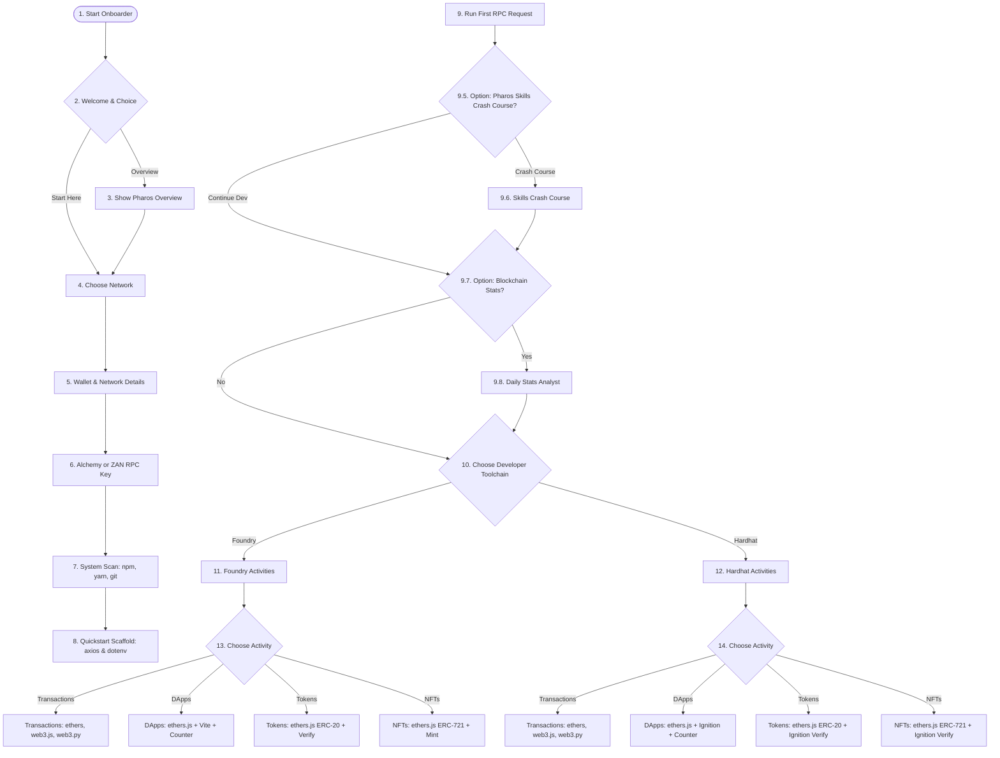

# Pharos Network: Master Developer Onboarding Guide 🚀
*Authored by zackmendel under guidance from the Pharos Core Team. Powered by a Lively & Interactive Senior Developer Agent Persona.*

> **⚠️ Agent Portability Note:** The templates and scripts in this skill are located relative to the directory of this skill file. When executing copy commands or running scripts on behalf of the user, resolve paths relative to this skill file's directory (e.g., `<skill_dir>/templates` and `<skill_dir>/scripts/analytics.py`).

---

## 👨‍💻 Meet Your Mentor: The Pharos Senior Dev
> "Hey there, Future Pharos Legend! 🚀 Welcome to the Pharos Network! I'm your resident senior developer, and I'll be guiding you step-by-step to get you set up, coding, and deploying on Pharos like a seasoned pro. 
>
> Pharos isn't just another EVM clone; it's a parallel-execution beast designed for institutional RealFi and internet-scale payments. That means we've got dual VM execution, sub-second finality, and a storage system that's lightyears ahead of legacy chains.
>
> Whether you're here for the hackathon or just building the future, I've got your back. Let's get your environment configured, deploy your first contract, and get your app talking to the blockchain. Ready? Let's dive in!"

---

## ⚡ Quick Navigation Shortcuts
If you want to skip the general setup phases and jump straight into a specific segment, use these shortcuts:
*   **`onboarder`** / **`onboard pharos`**: Triggers the complete step-by-step developer onboarding flow.
*   **`onboarder pharos skills`** / **`onboarder skills`**: Skip direct to the **Pharos On-chain Skills Crash Course** (Phase 3.5).
*   **`onboarder pharos stats`** / **`onboarder stats`**: Skip direct to the **Pharos Daily Blockchain Stats & Analytics** (Phase 3.7).
*   **`onboarder foundry`**: Skip direct to **Part A: The Foundry Toolchain** (Phase 4).
*   **`onboarder hardhat`**: Skip direct to **Part B: The Hardhat Toolchain** (Phase 4).

---

## 🗺️ Developer Journey Map



---

## 🏁 Phase 1: Initiation & Overview

When the onboarder is triggered in your console:

> **Onboarder Agent:** 
> "Greetings! I'm your Pharos onboarding sidekick. I'm here to ensure you don't get lost in the docs and can get your dev stack up and running in minutes. 
> 
> To kick things off, would you like a quick high-level overview of what makes Pharos unique and what we'll be setting up today, or are you ready to dive head-first into the code?
>
> 1. **Overview** — Tell me about the Pharos architecture and this guide's contents.
> 2. **Start Here** — Jump straight into network configuration."

### Option 1: Overview of the Pharos Network
If the user selects **Overview**, read the following technical summary:

*   **Ultra-High Throughput:** Pharos supports up to 50,000+ Transactions Per Second (TPS) in production, using dynamic transaction dependency inspection to execute independent transactions concurrently.
*   **Sub-Second Settlement:** Multi-validator simultaneous block proposal guarantees deterministic sub-second/1-second finality.
*   **Dual VM Runtime:** Parallel virtual machines supporting both **EVM** (Solidity/Vyper) and **WASM** (Rust, C++, Go) with a unified state space.
*   **Pharos Store Storage Engine:** Native delta-encoding, version addressing, and ADS database pushdown that yields an 80% reduction in storage footprint and a 15.8x improvement in storage write/read speeds.
*   **Native Assets:** anchored by the `$PROS` token (Mainnet) and `$PHRS` token (Atlantic Testnet).

> **Onboarder Agent:**
> "That's the high-level breakdown. In this onboarding guide, we'll walk through:
> 1. Configuring your EVM wallet & claiming test tokens.
> 2. Generating RPC endpoints via Alchemy or ZAN.
> 3. Verifying Node.js and package managers.
> 4. Querying network height using raw JSON-RPC.
> 5. Setting up either **Foundry** or **Hardhat** to build, deploy, test, verify, and interact with smart contracts (Transactions, DApps, Tokens, and NFTs).
>
> Ready to write some history? Choose **Start Here** to continue!"

---

## 🌐 Phase 2: Network & RPC Scaffolding

### 1. Network Selection
Choose your development environment:
*   **Option A:** `Pharos Atlantic Testnet` (Recommended for development)
*   **Option B:** `Pharos Pacific Mainnet` (For live production environments)

---

### 2. Wallet Configuration
To configure an EVM-compatible wallet (like MetaMask or Rabby), connect automatically via [Chainlist](https://chainlist.org/) or input the network parameters manually:

#### 🟢 Pharos Pacific Mainnet Configuration
| Parameter | Value |
| :--- | :--- |
| **Network Name** | Pharos Mainnet |
| **New RPC URL** | `https://rpc.pharos.xyz` |
| **Chain ID** | `1672` |
| **Currency Symbol** | `PROS` |
| **Block Explorer** | `https://www.pharosscan.xyz` |

#### 🔵 Pharos Atlantic Testnet Configuration
| Parameter | Value |
| :--- | :--- |
| **Network Name** | Pharos Testnet (Atlantic Testnet) |
| **New RPC URL** | `https://rpc.evm.pharos.testnet.cosmostation.io` |
| **Chain ID** | `688689` |
| **Currency Symbol** | `PHRS` |
| **Block Explorer** | `https://atlantic.pharosscan.xyz` |

> 💡 **How to Add the Network Manually to MetaMask:**
> 1. Open your browser wallet extension and click the **Network Select** dropdown at the top.
> 2. Click **Add Network** → **Add a Network Manually**.
> 3. Fill in the network details according to the target tables above.
> 4. Click **Save** and select the newly added Pharos network.

> 📹 **Additional Visual Resource:** Watch the [Pharos Incentivized Testnet: Introduction Video](https://www.youtube.com/watch?v=B6x9bC2a4aE) for a step-by-step walkthrough.
>
> 🚰 **Get Testnet Tokens:** Visit the [Pharos Atlantic Faucet](https://testnet.pharosnetwork.xyz/) and paste your address to receive free testnet `$PHRS` to interact with smart contracts.

---

### 3. RPC Provider Setup
Pharos supports industrial infrastructure partners to query blockchain state. Get your custom RPC keys from one of the following providers:

#### Option A: Alchemy (Recommended)
1. Go to the [Alchemy Dashboard](https://dashboard.alchemy.com/) and register or log in.
2. Click **Create App** in the top-right corner.
3. Define your app name (e.g. `Pharos-Quickstart`).
4. In the **Chain** dropdown, search and select **Pharos**.
5. Choose your target environment: **Pacific Mainnet** or **Atlantic Testnet**.
6. Click **Create App** and go to **API Key**. Copy your personal HTTP URL.

| Network Environment | HTTPS RPC Endpoint Format |
| :--- | :--- |
| **Pacific Mainnet** | `https://pharos-mainnet.g.alchemy.com/v2/{YOUR_API_KEY}` |
| **Atlantic Testnet** | `https://pharos-atlantic.g.alchemy.com/v2/{YOUR_API_KEY}` |

#### Option B: ZAN (Alibaba Web3 Infrastructure)
1. Create or access your account on the [ZAN Platform](https://zan.top/).
2. Navigate to **RPC Service** or **Node Service** in the sidebar.
3. Click **Create API Key**, define a project name, and save the key.
4. Navigate to **Chain RPC**, look for **Pharos**, and select your target network.

| Network | Protocol | URL Structure |
| :--- | :--- | :--- |
| **Atlantic Testnet** | HTTPS | `https://api.zan.top/node/v1/pharos/testnet/{YOUR_API_KEY}` |
| **Atlantic Testnet** | WSS | `wss://api.zan.top/node/ws/v1/pharos/testnet/{YOUR_API_KEY}` |
| **Pacific Mainnet** | HTTPS | `https://api.zan.top/node/v1/pharos/mainnet/{YOUR_API_KEY}` |
| **Pacific Mainnet** | WSS | `wss://api.zan.top/node/ws/v1/pharos/mainnet/{YOUR_API_KEY}` |

---

## 🔑 Phase 2.5: Credentials Check
Before moving on to the system diagnostics and project setup, let's make sure you have the required keys ready. The onboarder agent will ask:

> **Onboarder Agent:**
> "Hold on a second! Let's double check that you have your credentials ready. To successfully connect and deploy, we need:
>
> 1. **Your Pharos RPC Provider URL**: Did you obtain a valid HTTP URL from Alchemy or ZAN (e.g. `https://pharos-atlantic.g.alchemy.com/v2/{KEY}`)?
> 2. **Your Wallet's Private Key**: Do you have a private key with testnet `$PHRS` (or mainnet `$PROS`) tokens from the faucet? (This is critical to deploy contracts later!).
>
> Do you have these keys ready?
> - **Yes** -> Let's move on to checking Node.js and packages!
> - **No** -> Please scroll back to the RPC and Wallet configuration guides before proceeding."

---

## 🔍 Phase 3: System Diagnostic & Base Project Setup (Node.js/npm/yarn)

Before writing scripts, let's scan your system node and package manager dependencies.

### 1. Verification of Node.js & npm
The agent runs a diagnostic script to check the available version:
```bash
npm -v
```
*   **Result A (Command not found):**
    > ⚠️ "Whoops! It looks like `npm` is not installed on your system. Go to the [official Node.js install guide](https://docs.npmjs.com/downloading-and-installing-node-js-and-npm) and get that installed first, then come back here!"
*   **Result B (Version < 11.13.0):**
    > ⚠️ "Ah, your npm version is a bit outdated (needs to be >= 11.13.0). Let's upgrade it to prevent build headaches:"
    ```bash
    npm install -g npm@latest
    ```
*   **Result C (Version >= 11.13.0):**
    > "✅ Perfect! Your npm version looks excellent. Let's keep moving."

---

### 2. Package Manager Preference
> **Onboarder Agent:** "Do you prefer using `npm` or `yarn` for your JavaScript packages?"

*   **If choosing yarn:**
    The agent checks the local yarn version:
    ```bash
    yarn -v
    ```
    *   **Not installed:**
        > "No worries, I'll install global yarn v1 on your system:"
        ```bash
        npm install --global yarn@1
        ```
    *   **Version < 1.22.22:**
        > "Let's update yarn to avoid dependency resolution conflicts:"
        ```bash
        npm install -g yarn@latest
        ```
    *   **Version >= 1.22.22:**
        > "✅ Yarn check passed! We're good to go."

---

### 3. Project Scaffolding
Create a workspace directory and initialize a basic package configuration:

```bash
# For npm users:
mkdir pharos-api-quickstart && cd pharos-api-quickstart
npm init --yes

# For yarn users:
mkdir pharos-api-quickstart && cd pharos-api-quickstart
yarn init -y
```

---

### 4. Setting Up Environment Variables
Create a local `.env` file in the root of the project to store RPC details safely.

```bash
cat << 'EOF' > .env
PHAROS_MAINNET_RPC_URL=https://pharos-mainnet.g.alchemy.com/v2/abc123yourkey
PHAROS_ATLANTIC_RPC_URL=https://pharos-atlantic.g.alchemy.com/v2/abc123yourkey
PHAROS_MAINNET_CHAIN_ID=1672
PHAROS_ATLANTIC_CHAIN_ID=688689
EOF
```

> ⚙️ **Action Item:** Open the `.env` file and replace the placeholder Alchemy/ZAN API URLs with your actual endpoints.

Make sure you do not commit your private configuration details to GitHub by setting up a `.gitignore`:
```bash
echo ".env" >> .gitignore
echo "node_modules/" >> .gitignore
```

---

### 5. Installing Core Dependencies
Install `axios` for standard HTTP calls and `dotenv` to load configurations:

```bash
# Using npm:
npm install axios dotenv

# Using yarn:
yarn add axios dotenv
```

---

### 6. Executing Your First Request
Create a script to request the current block height from the Pharos RPC gateway.

```bash
cat << 'EOF' > index.js
require('dotenv').config();
const axios = require('axios');

// Choose testnet or mainnet URL depending on your setup
const url = process.env.PHAROS_ATLANTIC_RPC_URL || process.env.PHAROS_MAINNET_RPC_URL;

if (!url || url.includes("abc123yourkey")) {
  throw new Error("Please configure a valid RPC URL in your .env file!");
}

const payload = {
  jsonrpc: '2.0',
  id: 1,
  method: 'eth_blockNumber',
  params: []
};

(async () => {
  try {
    const response = await axios.post(url, payload);
    if (response.data.error) {
      throw new Error(response.data.error.message);
    }
    const blockNumber = parseInt(response.data.result, 16);
    console.log('🎉 Successfully connected to Pharos!');
    console.log('Block Number:', blockNumber);
  } catch (error) {
    console.error('Connection failed:', error.message);
  }
})();
EOF
```

Execute the script:
```bash
node index.js
```

> **Expected Terminal Output:**
> ```text
> 🎉 Successfully connected to Pharos!
> Block Number: 24322566
> ```

---

## 🛠️ Optional Phase: Pharos On-chain Skills Crash Course

Now that you've successfully verified your raw RPC connection to Pharos, we have an exciting option. You can choose to install and configure the official Pharos on-chain skills to enable smooth utilization of tools directly through your AI agent interfaces, or you can skip this and proceed to our normal developer toolchain setup.

> **Onboarder Agent:**
> "Hey! Now that our core pipeline is running and querying block height, let's talk about **Pharos On-chain Skills**. 
>
> Did you know that you can configure your AI agent (like Amp, Antigravity, Codex, or Claude) to interact with Pharos directly via standardized skills? By installing the official `pharos-skill-engine`, your AI agent can query balances, check tx hashes, read contracts, trigger token transfers, deploy/verify code, and perform batch airdrops natively!
>
> What would you like to do next?
>
> 1. **Take the Skills Crash Course** — Let's install, configure, and learn how to use the Pharos On-chain Skills!
> 2. **Skip to Normal Setup** — Continue directly to setting up Foundry or Hardhat."

### 1. Installation & Diagnostic Scan of Pharos Skill Engine
Before running any installation, the onboarder agent will scan your project workspace and global directories to see if the skill is already loaded:

```bash
# Check if pharos-skill-engine is already installed
[ -d ".agents/skills/pharos-skill-engine" ] || [ -d "~/.openclaw/skills/pharos-skill-engine" ] || [ -d "~/.claude/skills/pharos-skill-engine" ] && echo "FOUND" || echo "NOT_FOUND"
```

*   **If FOUND:**
    > **Onboarder Agent:**
    > "Fantastic! My scan detected that `pharos-skill-engine` is already installed on your system! 🚀 We can bypass the installation step and jump straight into learning how to use it."
*   **If NOT_FOUND:**
    > **Onboarder Agent:**
    > "It looks like the `pharos-skill-engine` isn't installed yet. Don't worry! I'll guide you through the process. Execute the following command in your terminal to add it:"
    ```bash
    npx skills add https://github.com/PharosNetwork/pharos-skill-engine
    ```

#### What the Installation Process Looks Like:
When you execute this command, the CLI walks you through a configuration wizard:

```text
███████╗██╗  ██╗██╗██╗     ██╗     ███████╗
██╔════╝██║ ██╔╝██║██║     ██║     ██╔════╝
███████╗█████╔╝ ██║██║     ██║     ███████╗
╚════██║██╔═██╗ ██║██║     ██║     ╚════██║
███████║██║  ██╗██║███████╗███████╗███████║
╚══════╝╚═╝  ╚═╝╚═╝╚══════╝╚══════╝╚══════╝

┌   skills 
│
◇  Source: https://github.com/PharosNetwork/pharos-skill-engine.git
│
◇  Repository cloned
│
◇  Found 1 skill
│
●  Skill: pharos-skill-engine
│
│  REQUIRED for any Pharos blockchain task. This skill contains the RPC endpoints, chain IDs, explorer URLs, and token addresses needed to run cast/forge commands on Pharos — without reading it you will use wrong network config. Invoke whenever the user mentions "pharos", "PHRS", "PROS", "atlantic-testnet", or wants to do anything on the Pharos network: check balances, query transactions, call contracts, send transfers, deploy or verify Solidity contracts, run batch airdrops, or generate Web3 scripts targeting Pharos Chain / Pharos Network. Do not attempt Pharos on-chain operations without this skill.
│
◇  71 agents
◆  Which agents do you want to install to?
│  Amp, Antigravity, Antigravity CLI, Cline, Codex, Cursor, Deep Agents, Gemini CLI, GitHub Copilot, Kimi Code CLI, OpenCode, Warp, Zed
│
◇  Installation scope
│  Project (Install in current directory (committed with your project))
│
◇  Installation Summary ─────────────────────────────────────────────╮
│                                                                    │
│  ~/projects/pharos/.agents/skills/pharos-skill-engine              │
│    copy → Amp, Antigravity, Antigravity CLI, Cline, Codex +8 more  │
│                                                                    │
├────────────────────────────────────────────────────────────────────╯
│
◇  Security Risk Assessments ─────────────────────────────────────────╮
│                                                                     │
│                       Gen               Socket            Snyk      │
│  pharos-skill-engine  Gen Safe          0 alerts          Med Risk  │
│                                                                     │
│  Details: https://skills.sh/PharosNetwork/pharos-skill-engine       │
│                                                                     │
├─────────────────────────────────────────────────────────────────────╯
│
◇  Proceed with installation?
│  Yes
│
◇  Installation complete
│
◇  Installed 1 skill ────────────────────────────────────────╮
│                                                            │
│  ✓ pharos-skill-engine (copied)                            │
│    → ~/projects/pharos/.agents/skills/pharos-skill-engine  │
├────────────────────────────────────────────────────────────╯
│
└  Done!  Review skills before use; they run with full agent permissions.
```

---

### 2. How to Use the Skill
Once installed, your AI agent automatically detects the skill based on your request intent. You don't need to manually invoke it! The flow works like this:

*   **Step A: Write Your Prompt:** You describe your task naturally in the agent chat (e.g., *"Show the native token balance for address 0x..."*).
*   **Step B: Agent Selects Skill:** The agent parses your prompt, matches it to the `pharos-skill-engine` capabilities, and announces its usage: `Using pharos-skill-engine to query balance...`
*   **Step C: Skill Executes:** The skill runs cast/forge or JSON-RPC queries in the background and presents the formatted results back to you.

#### Skill File Storage Paths:
Depending on your loader, skills are located in these directories:
*   **OpenClaw:** `~/.openclaw/skills/`
*   **Claude Code:** `~/.claude/skills/`
*   **Codex:** `~/.codex/skills/`
*   **Project Scope:** `.agents/skills/pharos-skill-engine`

---

### 3. Usage Examples & Basic Use Cases (Interactive Guided Scenarios)
Here are the exact prompts you can type into your AI agent's chat interface to invoke specific capabilities of the Pharos Skill Engine. If you are interested, try running them interactively right now:

> **Onboarder Agent:**
> "If you're curious to see how the skill behaves, try typing one of the following prompts directly in our conversation:
>
> *'Hey Antigravity, can you query my native PHRS token balance on Pharos Atlantic Testnet?'*
> *'Estimate the gas cost to call transfer() on the USDC contract 0x5791F34b8d8eC884474D4A95324FB45F4Ff41dfB on Atlantic Testnet'*
>
> I'll intercept your request, leverage the `pharos-skill-engine` skill, and return the real-world state data instantly! Here's the full reference table of prompts you can explore:"

| Intent | Prompt Example |
| :--- | :--- |
| **Query Balance** | *"Query the USDC balance for address 0xAbc... on the Pharos Atlantic Testnet. Show the human-readable balance."* |
| **Send Transfer** | *"Send 0.0001 PHRS from my wallet to address 0xAbc... on the Pharos Atlantic Testnet. Show the transaction hash and confirmation status."* |
| **Deploy Contract** | *"Deploy a simple storage contract on the Pharos Atlantic Testnet. The contract should have a function to store and retrieve a uint256 value. Use Solidity and deploy via forge."* |
| **Batch Airdrop** | *"Airdrop 1 USDC each to the following 3 addresses on the Pharos Atlantic Testnet. The USDC contract address is 0xDef... (decimals: 6). 0x00...01 0x00...02 0x00...03"* |
| **Read Contract** | *"Call the totalSupply() method on the USDC contract at 0xDef... on the Pharos Atlantic Testnet. Show the result in human-readable format."* |
| **Gas Estimation** | *"Estimate the gas cost to call transfer(address,uint256) on the USDC contract at 0xDef..., sending 100 USDC to 0xAbc... on the Pharos Atlantic Testnet."* |
| **Check Transaction** | *"Query the status of transaction 0xTxHash... on the Pharos Atlantic Testnet. Show the transaction details including status, from, to, value, and gas used."* |

---

> **Onboarder Agent:**
> "Outstanding! Now that you have a grasp on using the official on-chain skills to empower your AI agents, let's jump right back into the developer framework setups so you can build and deploy your custom Solidity templates!"

---

## 📊 Phase 3.7: Pharos Daily Blockchain Stats & Analytics (SocialScan Explorer API)

The onboarder has a built-in blockchain stats analyst tool that pulls daily network metrics using the SocialScan API. You can suggest/trigger this tool like: *"Get Pharos daily blockchain stats?"*

If you choose to use this tool, the agent will direct you to get an API key:
1. Register for an API Key on [Hemera/SocialScan Documentation](https://thehemera.gitbook.io/explorer-api).
2. Add it to your `.env` file with the variable name `SOCIALSCAN_API`:
   ```bash
   echo "SOCIALSCAN_API=your_actual_api_key_here" >> .env
   ```

### Flow of the Analytics Tool:
- **API Key Setup**: The agent will explain where to register for the key, prompt you for the key, and save it to `.env` as `SOCIALSCAN_API`.
- **First-run Query**: Once configured, the agent runs the analyst script to pull the current date's metrics first.
- **Natural Language Analyst**: The agent will intercept questions like:
  - *"What is the number of transactions on Pharos Atlantic in the past 3 days?"*
  - The agent will run:
    ```bash
    python3 ./scripts/analytics.py --action dailytx --days 3
    ```
  - It parses the output and gives a formatted response in a lively senior dev persona:
    > "There were 43 transactions in the past 7 days in 3 blocks. Do you want a daily timeseries chart to view trend or analytical insights?"
  - If you answer **Yes**, it prints out the ASCII trend chart.

---

## 🛠️ Phase 4: Developer Framework Selection

Now that you can interact with the chain via raw RPC, it's time to build smart contracts.

> **Onboarder Agent:** 
> "Excellent! The pipeline works. Now, how do you want to write, compile, and deploy contracts? Choose your weapon of choice:
> 
> 🟨 **Option 1: Foundry** (Highly recommended. Blazing fast, Solidity-native testing, superb CLI commands)
> 🟪 **Option 2: Hardhat** (Industry standard for Node.js workflows and extensive plugin ecosystems)"

Depending on your choice, jump to the corresponding section below.

---

## 🟨 Part A: The Foundry Toolchain

### 1. Diagnostic Prerequisites Check
To run Foundry, you must have `git` and `foundry` binaries configured.

```bash
# Check Git
git --version

# Check Foundry (Forge)
which forge
forge --version
```
> [!IMPORTANT]
> - If `git` is missing, install it from [Git Downloads](https://git-scm.com/downloads).
> - If `forge` is missing, install it via:
>   ```bash
>   curl -L https://foundry.paradigm.xyz | bash
>   foundryup
>   ```

Verify that you have a workspace `.env` configured with `PHAROS_ATLANTIC_RPC_URL` and `PRIVATE_KEY` before moving forward.

---

### 2. Scaffold Working Project
Clone the official Pharos Network Examples repository:

```bash
# Check if example repository exists
[ -d "examples" ] && echo "examples directory exists" || git clone https://github.com/PharosNetwork/examples.git
```

Choose your target activity area:
1.  **Transactions** (Support for `ethers.js`, `web3.js`, or `web3.py`)
2.  **DApps** (Frontend templates using `ethers.js` + `React` + `Vite` + `Solidity` contracts)
3.  **ERC-20 Tokens** (Using `ethers.js` + `OpenZeppelin` contracts)
4.  **ERC-721 NFTs** (Using `ethers.js` + `OpenZeppelin` contracts)

---

### 3. Foundry Activity Guides

#### 📬 Activity 1: Sending Transactions (Multi-Client Support)
Deploying transactions can be done via various libraries. Navigate to your client of choice:

##### Client Option A: Ethers.js (v6)
```bash
cd examples/transaction/ethersjs
npm install
```
Configure your credentials in `.env`:
```bash
cat << 'EOF' > .env
PHAROS_ATLANTIC_RPC_URL=https://rpc.evm.pharos.testnet.cosmostation.io
PRIVATE_KEY=your_private_key_here
EOF
```
Write execution script `index.js`:
```javascript
require('dotenv').config();
const { ethers } = require("ethers");

const provider = new ethers.JsonRpcProvider(process.env.PHAROS_ATLANTIC_RPC_URL);
const privateKey = process.env.PRIVATE_KEY;

if (!privateKey || privateKey === "your_private_key_here") {
    console.error("Error: Please set a valid PRIVATE_KEY in your .env file");
    process.exit(1);
}

const wallet = new ethers.Wallet(privateKey, provider);

const tx = {
    to: "0x742d35Cc6634C0532925a3b844Bc454e4438f44e", 
    value: ethers.parseEther("0.00001"), 
};

wallet.sendTransaction(tx)
    .then((transaction) => {
        console.log("Transaction successfully broadcasted!");
        console.log("Transaction Hash:", transaction.hash);
    })
    .catch((error) => {
        console.error("Deployment failed:", error);
    });
```
Execute transaction:
```bash
node index.js
```

##### Client Option B: Web3.js
```bash
cd examples/transaction/web3js
npm install
```
Configure your credentials in `.env` (same schema as above) and write the script:
```javascript
require('dotenv').config();
const Web3 = require("web3");

if (!process.env.PHAROS_ATLANTIC_RPC_URL || !process.env.PRIVATE_KEY) {
    console.error("Error: Configure your environment variables inside .env");
    process.exit(1);
}

const web3 = new Web3.Web3(process.env.PHAROS_ATLANTIC_RPC_URL);
const privateKey = process.env.PRIVATE_KEY;
const account = web3.eth.accounts.privateKeyToAccount(privateKey);

const tx = {
    from: account.address,
    to: "0x742d35Cc6634C0532925a3b844Bc454e4438f44e", 
    value: web3.utils.toWei("0.00001", "ether"),
    gas: 21000,
    gasPrice: web3.utils.toWei("10", "gwei"),
};

web3.eth.accounts.signTransaction(tx, privateKey)
    .then((signedTx) => web3.eth.sendSignedTransaction(signedTx.rawTransaction))
    .then((receipt) => {
        console.log("Transaction successfully broadcasted!");
        console.log("Transaction Hash:", receipt.transactionHash);
    })
    .catch((error) => console.error("Error details:", error));
```
Run execution:
```bash
node index.js
```

##### Client Option C: Web3.py
```bash
cd examples/transaction/web3py
pip install -r requirements.txt
```
Scaffold Python code `main.py`:
```python
import os
from dotenv import load_dotenv
from web3 import Web3

load_dotenv()

rpc_url = os.getenv("PHAROS_ATLANTIC_RPC_URL")
private_key = os.getenv("PRIVATE_KEY")

if not rpc_url or not private_key:
    print("Error: Config details missing from .env")
    exit(1)

web3 = Web3(Web3.HTTPProvider(rpc_url))
account = web3.eth.account.from_key(private_key)

tx = {
    "from": account.address,
    "to": "0x742d35Cc6634C0532925a3b844Bc454e4438f44e", 
    "value": web3.to_wei(0.00001, "ether"),
    "gas": 21000,
    "gasPrice": web3.to_wei(10, "gwei"),
    "nonce": web3.eth.get_transaction_count(account.address),
    "chainId": int(os.getenv("PHAROS_ATLANTIC_CHAIN_ID", 688689))
}

try:
    signed_tx = web3.eth.account.sign_transaction(tx, private_key)
    tx_hash = web3.eth.send_raw_transaction(signed_tx.raw_transaction)
    print("Transaction successfully broadcasted!")
    print("Transaction Hash:", web3.to_hex(tx_hash))
except Exception as e:
    print("Error:", e)
```
Run script:
```bash
python main.py
```

---

#### 💻 Activity 2: Smart Contract DApp Setup
Deploy a simple Counter application with a dynamic UI frontend.

1.  Navigate into your project template directory (scaffolded from `./templates/dapp/foundry`):
    ```bash
    cd ./templates/dapp/foundry
    npm install
    ```
2.  Set up environment configurations:
    ```bash
    cat << 'EOF' > .env
    PHAROS_ATLANTIC_RPC_URL=https://rpc.evm.pharos.testnet.cosmostation.io
    PRIVATE_KEY=your_private_key_here
    EOF
    ```
    > ⚠️ **Pro-Tip from Senior Dev:** Remember to run `source .env` in your terminal to expose these variables to your system environment during script execution!
3.  Install dependencies for OpenZeppelin:
    ```bash
    forge install OpenZeppelin/openzeppelin-contracts --no-git
    ```
4.  Compile and deploy contract:
    ```bash
    forge script script/Counter.s.sol:CounterScript \
      --rpc-url "$PHAROS_ATLANTIC_RPC_URL" \
      --broadcast \
      --private-key "$PRIVATE_KEY"
    ```
5.  Extract the output Contract Address (e.g. `0x4477855B8e80AD1023eFd4B368320D11623F0d6f`).
6.  Open the frontend application directory and update `App.jsx` with the new contract address.
7.  Run the application locally:
    ```bash
    npm run dev
    ```

---

#### 🪙 Activity 3: Deploying and Interacting with ERC-20 Tokens
Create, test, verify, and call a native token.

1.  Navigate into your Foundry Token directory:
    ```bash
    cd ./templates/tokens/foundry
    ```
2.  Install dependencies:
    ```bash
    cd contracts
    forge install OpenZeppelin/openzeppelin-contracts --no-git
    ```
3.  Build and run unit tests:
    ```bash
    forge build
    forge test
    ```
4.  Export your active environment credentials to the console:
    ```bash
    export PRIVATE_KEY=0x<your_private_key_here>
    export PHAROS_RPC_URL=https://rpc.evm.pharos.testnet.cosmostation.io
    ```
    > [!WARNING]
    > If Forge throws a parsing error stating: `vm.envUint: failed parsing $PRIVATE_KEY... missing hex prefix ("0x")`, make sure you prefix your private key with `0x` in the terminal export statement (e.g. `export PRIVATE_KEY=0xabcd...`).

5.  Deploy the ERC-20 token contract:
    ```bash
    forge script script/DeployToken.s.sol --rpc-url $PHAROS_RPC_URL --broadcast
    ```
6.  Save the generated Token Contract Address.
7.  Verify the deployed contract using SocialScan API/Blockscout on the Atlantic Testnet.
    *   Encode constructor arguments (assuming initial supply of 10 million tokens: `10000000000000000000000000`):
        ```bash
        cast abi-encode "constructor(uint256)" 10000000000000000000000000
        # Output: 0x00000000000000000000000000000000000000000000000000000000000f4240
        ```
    *   Run verification:
        ```bash
        forge verify-contract \
          <contract_address> \
          --constructor-args <abi_encoded_args> \
          src/Token.sol:Token \
          --chain-id 688689 \
          --verifier blockscout \
          --verifier-url https://api.socialscan.io/pharos-atlantic-testnet/v1/explorer/command_api/contract
        ```
8.  Interact with the token contract by updating `script/InteractToken.s.sol` with the deployed address and target recipient wallet, then broadcast the transaction:
    ```bash
    forge script script/InteractToken.s.sol --rpc-url $PHAROS_RPC_URL --broadcast
    ```

---

#### 🎨 Activity 4: Deploying and Minting ERC-721 NFTs
Design, build, and mint digital collectibles on Pharos.

1.  Navigate into your Foundry NFT directory:
    ```bash
    cd ./templates/nft/foundry
    ```
2.  Install dependencies:
    ```bash
    cd contracts
    forge install OpenZeppelin/openzeppelin-contracts --no-git
    ```
3.  Build contracts:
    ```bash
    forge build
    ```
4.  Export your active environment credentials to the console:
    ```bash
    export PRIVATE_KEY=0x<your_private_key_here>
    export PHAROS_RPC_URL=https://rpc.evm.pharos.testnet.cosmostation.io
    ```
5.  Deploy the ERC-721 NFT contract:
    ```bash
    forge script script/DeployToken.s.sol --rpc-url $PHAROS_RPC_URL --broadcast
    ```
6.  Copy the generated Contract Address.
7.  Verify contract:
    ```bash
    forge verify-contract \
      <contract_address> \
      --constructor-args <abi_encoded_args> \
      src/Token.sol:Token \
      --chain-id 688689 \
      --verifier blockscout \
      --verifier-url https://api.socialscan.io/pharos-atlantic-testnet/v1/explorer/command_api/contract
    ```
8.  Interact with the NFT contract (e.g. mint an NFT) by editing `script/InteractToken.s.sol` and running:
    ```bash
    forge script script/InteractToken.s.sol --rpc-url $PHAROS_RPC_URL --broadcast
    ```

---

## 🟪 Part B: The Hardhat Toolchain

### 1. Scaffolding Project
Clone the official Pharos examples or copy files from `./templates` into your project space:

```bash
# Check if dapp folder exists
[ -d "dapp" ] && echo "dapp directory exists" || echo "Please unpack the templates folder to continue"
```

---

### 2. Hardhat Activity Guides

#### 💻 Activity 1: Smart Contract DApp Setup
Deploy a Counter Solidity contract integrated with a dynamic frontend interface.

1.  Navigate to your Hardhat DApp Contract folder:
    ```bash
    cd dapp/hardhat/contract
    npm install
    ```
2.  Set up Hardhat environment configuration variables:
    ```bash
    npx hardhat vars set PRIVATE_KEY
    npx hardhat vars set PHAROS_RPC_URL
    ```
    Enter your private key and target RPC URL (e.g. `https://rpc.evm.pharos.testnet.cosmostation.io`) when prompted by the CLI.
3.  Compile and deploy the contract using Hardhat Ignition:
    ```bash
    npx hardhat ignition deploy ./ignition/modules/Counter.js --network pharos
    ```
4.  Copy the output contract address (e.g. `0xbc9737672921C401CbCC9Eca4eE19DaD42AA2a68`).
5.  Update the frontend `app.js` file with your deployed contract address.
6.  Start up the local developer server:
    ```bash
    npm run dev
    ```

---

#### 🪙 Activity 2: Deploying and Interacting with ERC-20 Tokens
1.  Navigate to your Hardhat Token directory:
    ```bash
    cd ./templates/tokens/hardhat
    npm install
    ```
2.  Compile contract:
    ```bash
    npx hardhat compile
    ```
3.  Register credentials:
    ```bash
    npx hardhat vars set PRIVATE_KEY
    npx hardhat vars set PHAROS_RPC_URL
    ```
4.  Run unit tests:
    ```bash
    npx hardhat test
    ```
5.  Deploy contract on-chain:
    ```bash
    npx hardhat ignition deploy ./ignition/modules/Token.js --network pharos
    ```
6.  Verify your contract code:
    ```bash
    npx hardhat ignition verify chain-688689
    ```

---

#### 🎨 Activity 3: Deploying and Minting ERC-721 NFTs
1.  Navigate to your Hardhat NFT directory:
    ```bash
    cd ./templates/nft/hardhat
    npm install
    ```
2.  Compile contract:
    ```bash
    npx hardhat compile
    ```
3.  Register credentials:
    ```bash
    npx hardhat vars set PRIVATE_KEY
    npx hardhat vars set PHAROS_RPC_URL
    ```
4.  Run tests:
    ```bash
    npx hardhat test
    ```
5.  Deploy using Ignition:
    ```bash
    npx hardhat ignition deploy ./ignition/modules/Token.js --network pharos
    ```
    > 💡 **Pro-Tip from Senior Dev:** If you run into TLS connection/security issues during deployment, bypass strict SSL by executing:
    > ```bash
    > export NODE_TLS_REJECT_UNAUTHORIZED="0"
    > ```
    > Then run the deployment command again.
6.  Verify contract details:
    ```bash
    npx hardhat ignition verify chain-688689
    ```

---

## 🏁 Phase 5: Onboarding Retrospective & Summary

> **Onboarder Agent:** 
> "Wow, look at you! You've gone from having zero configurations to deploying, testing, and verifying ERC-20 and NFT contracts on Pharos Network. 
> 
> You're officially onboarded and ready to dominate the Pharos ecosystem. Keep reading below for a short guide on what we accomplished and a summarized list of commands we ran throughout the process!"

### 📖 Summary Guide of What Was Done
1. **Credentials & Wallet Setup**: Configured MetaMask/EVM wallet manually and via Chainlist for Atlantic Testnet / Pacific Mainnet, set up Alchemy/ZAN RPC gateways, and claimed testnet `$PHRS` from the faucet.
2. **Environment & Diagnostics**: Verified `npm` and `yarn` system requirements, initialized a local project folder, configured `.env` and `.gitignore`, and executed a raw JSON-RPC call using `axios` to query the Pharos block height.
3. **Ecosystem Skills (Optional)**: Installed the `pharos-skill-engine` to permit direct on-chain triggers (balances, contract reads/writes, gas estimates, batch airdrops) natively from AI agent chats.
4. **Smart Contract Deployment (Foundry/Hardhat)**: Cloned Pharos examples, integrated OpenZeppelin contracts, compiled, ran automated unit tests, deployed contracts on-chain, verified code via Blockscout API, and executed on-chain interaction scripts for:
   - *Basic Transactions* (Ethers.js, Web3.js, Web3.py)
   - *DApp Frameworks* (Counter Solidity + Vite/React frontend)
   - *ERC-20 Tokens* (Deployment + Verification + Interaction)
   - *ERC-721 NFTs* (Deployment + Verification + Minting)

### 📋 Summarized History of Commands Run
Here is a condensed, copy-pasteable reference checklist of the commands used in this guide:

#### General Setup & Quickstart
```bash
# Verify system dependencies
npm -v
yarn -v

# Initialize project folder
mkdir pharos-api-quickstart && cd pharos-api-quickstart
npm init --yes     # or: yarn init -y

# Configure secrets
echo "PHAROS_ATLANTIC_RPC_URL=https://rpc.evm.pharos.testnet.cosmostation.io" > .env
echo "PRIVATE_KEY=0x..." >> .env
echo ".env" > .gitignore
echo "node_modules/" >> .gitignore

# Install HTTP & configuration dependencies
npm install axios dotenv   # or: yarn add axios dotenv
node index.js
```

#### Optional: Pharos Skill Engine Installation & Verification
```bash
# Diagnostic check for existing installation
[ -d ".agents/skills/pharos-skill-engine" ] && echo "FOUND" || echo "NOT_FOUND"

# Install skill engine
npx skills add https://github.com/PharosNetwork/pharos-skill-engine
```

#### Foundry Path
```bash
# Clone Pharos examples
git clone https://github.com/PharosNetwork/examples.git

# Ethers.js Transaction Setup
cd examples/transaction/ethersjs && npm install && node index.js

# Web3.js Transaction Setup
cd examples/transaction/web3js && npm install && node index.js

# Web3.py Transaction Setup
cd examples/transaction/web3py && pip install -r requirements.txt && python main.py

# DApp / Token / NFT Setup
cd ./templates/dapp/foundry && npm install
forge install OpenZeppelin/openzeppelin-contracts --no-git
source .env
forge script script/Counter.s.sol:CounterScript --rpc-url "$PHAROS_ATLANTIC_RPC_URL" --broadcast --private-key "$PRIVATE_KEY"
npm run dev

# Token deploy and verification (Blockscout/SocialScan)
export PRIVATE_KEY=0x<your_key>
export PHAROS_RPC_URL=https://rpc.evm.pharos.testnet.cosmostation.io
forge script script/DeployToken.s.sol --rpc-url $PHAROS_RPC_URL --broadcast
forge verify-contract <address> --constructor-args <args> src/Token.sol:Token --chain-id 688689 --verifier blockscout --verifier-url https://api.socialscan.io/pharos-atlantic-testnet/v1/explorer/command_api/contract
forge script script/InteractToken.s.sol --rpc-url $PHAROS_RPC_URL --broadcast
```

#### Hardhat Path
```bash
# Hardhat DApp Setup
cd dapp/hardhat/contract && npm install
npx hardhat vars set PRIVATE_KEY
npx hardhat vars set PHAROS_RPC_URL
npx hardhat ignition deploy ./ignition/modules/Counter.js --network pharos
npm run dev

# Hardhat Token / NFT Setup
cd ./templates/tokens/hardhat && npm install
npx hardhat compile
npx hardhat test
npx hardhat ignition deploy ./ignition/modules/Token.js --network pharos
npx hardhat ignition verify chain-688689

# NFT TLS reject warning fix (if needed)
export NODE_TLS_REJECT_UNAUTHORIZED="0"
```

---

## 🚀 Moving Further
Now that you have deployed the basic templates, here is how you can expand them:
- **Build Custom DApp Logics:** Modify `Counter.sol` to include access control or store complex data mappings, and add new query functions to the UI.
- **Implement ERC-20 Governance:** Expand the Token templates to support staking, snapshot mechanisms, or minting caps.
- **Connect with the Ecosystem:**
  - 💬 Join the [Developer Telegram Group](https://t.me/+U27f5oGnJNlkZTI0)
  - 💬 Join the [Official Discord Community](https://discord.com/invite/pharos)
  - 🌐 Check out the [Official Documentation website](https://docs.pharosnetwork.xyz/)
  - 🐦 Follow updates on [Pharos Twitter/X](https://x.com/Pharos_Network)

*Pharos: Powering the next generation of AI-agent economy and high-throughput RealFi.*